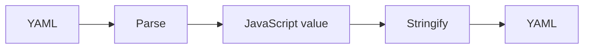
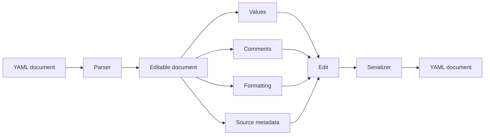
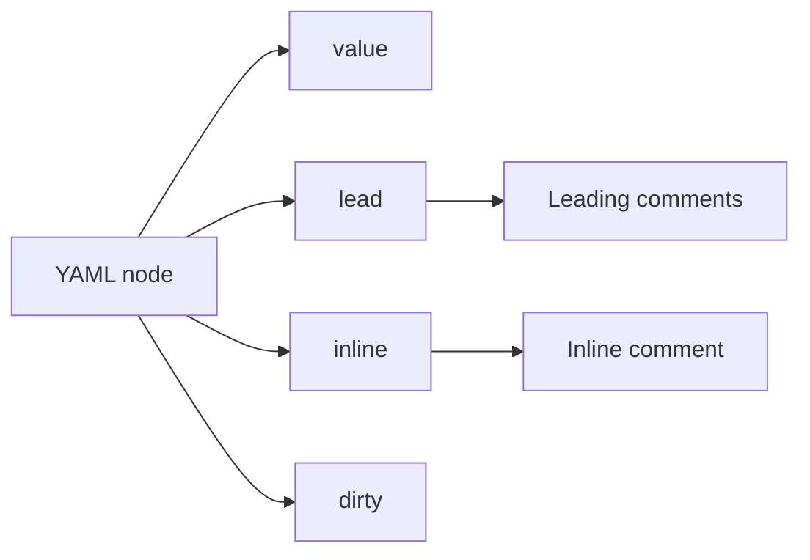
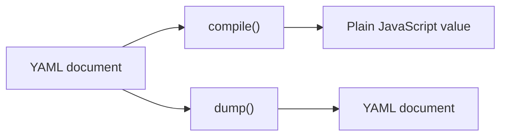
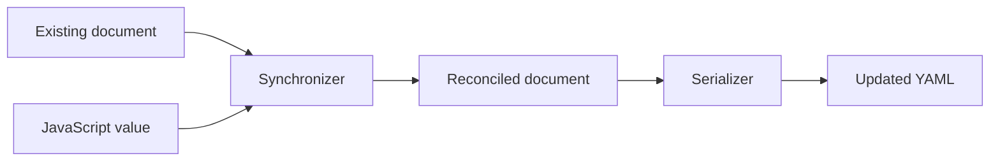
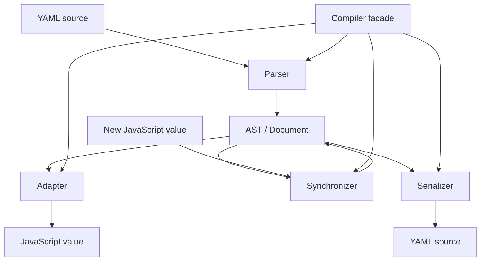
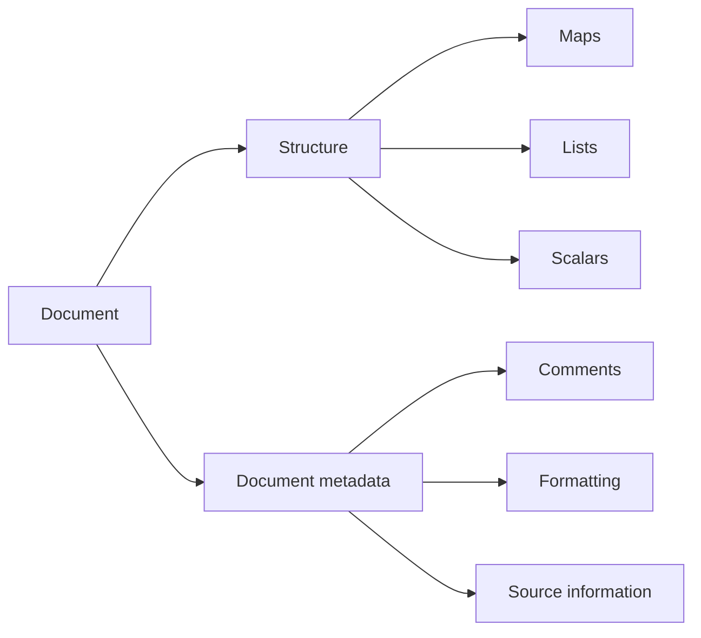

# @netfeez/yaml

**YAML is a document. Treat it like one.**

An environment-agnostic TypeScript library for **editing YAML documents without throwing away the parts you didn't change.**

```text
Parse. Edit. Synchronize. Serialize.
```

## Installation

```bash
npm install @netfeez/yaml
```

---

## Why?

Most YAML tooling follows this model:



That works perfectly when YAML is simply a serialization format.

But configuration files are not just data.

They contain:

* comments
* formatting
* quoting choices
* document structure
* metadata
* information that exists for humans, not programs

If you parse a configuration file into a plain JavaScript object and serialize it again, much of that information is gone.

`@netfeez/yaml` takes a different approach:



The YAML document itself remains the source of truth.

---

# The difference

Consider:

```yaml
# Application server
server:
  host: localhost
  port: 8080 # HTTP port
```

You only want to change the port.

With a traditional parse → stringify workflow:

```text
YAML
 ↓
JavaScript object
 ↓
modify port
 ↓
generate new YAML
```

you are asking the serializer to reconstruct a document it never actually knew.

With `@netfeez/yaml`:

```text
YAML
 ↓
Document
 ↓
modify port
 ↓
Document
 ↓
YAML
```

the original document is still there.

```ts
const document = Compiler.parse(source);

document.get('server.port')!.value = 9090;

const result = Compiler.dump(document);
```

The result can remain:

```yaml
# Application server
server:
  host: localhost
  port: 9090 # HTTP port
```

**You changed the value. The document stayed a document.**

---

# Features

* Editable YAML document model
* Lossless round-tripping for supported syntax
* Comments preserved
* Leading comment blocks preserved
* Inline comments preserved
* Existing source formatting preserved where possible
* Direct node editing
* Structural synchronization
* Deep path access
* Automatic intermediate container creation
* TypeScript-first API
* Environment-agnostic runtime
* Structured parsing errors
* No DOM dependency
* No filesystem dependency
* No runtime-specific dependency

---

# Quick start

```ts
import Compiler from '@netfeez/yaml';

const document = Compiler.parse(`
# Application configuration

server:
  host: localhost
  port: 8080 # HTTP port

database:
  host: db.internal
  port: 5432
`);

document.get('server.port')!.value = 9090;

document.set('server.timeout', 30);

document.delete('database.port');

console.log(Compiler.dump(document));
```

---

# Editing the document

## Read

```ts
const port = document.get('server.port');

console.log(port?.value);
```

Deep paths are supported:

```ts
document.get('dependencies.0.name');
```

---

## Change

```ts
document.get('server.port')!.value = 9090;
```

Existing node metadata remains attached to the node.

```yaml
port: 8080 # HTTP port
```

becomes:

```yaml
port: 9090 # HTTP port
```

---

## Add

```ts
document.set('server.timeout', 30);
```

Nested paths work as well:

```ts
document.set(
  'build.targets.production.output',
  './dist'
);
```

Missing intermediate containers are created automatically.

For sequences, missing indexes are padded with `null`.

---

## Delete

```ts
document.delete('server.timeout');
```

Only the target node is removed. Empty parent containers are not automatically garbage-collected.

---

# Comments are part of the document

Comments are not treated as disposable text.

They belong to the document model.

```ts
const node = document.get('server.port')!;

console.log(node.lead);
console.log(node.inline);
```

Leading comments are stored in `lead`:

```ts
node.lead.push(
  '# Connection settings',
  '# Used by the application server.'
);
```

Inline comments are stored in `inline`:

```ts
node.inline = '# HTTP port';
```

This makes comments editable too:



For example:

```ts
const node = document.set('server.timeout', 30);

node.lead.push(
  '# Connection timeout',
  '# Value is expressed in seconds.'
);

node.inline = '# Optional';
```

Produces:

```yaml
# Connection timeout
# Value is expressed in seconds.
server.timeout: 30 # Optional
```

---

# `compile()` vs `dump()`

These operations intentionally have different purposes.



## `compile()`

Use `compile()` when you want the **data**:

```ts
const value = Compiler.compile(document);
```

For:

```yaml
server:
  host: localhost
  port: 8080
```

the result is:

```ts
{
  server: {
    host: 'localhost',
    port: 8080
  }
}
```

---

## `dump()`

Use `dump()` when you want the **document**:

```ts
const yaml = Compiler.dump(document);
```

`dump()` serializes the editable document model rather than reconstructing YAML from a plain JavaScript object.

That distinction is fundamental to the library.

---

# Synchronization

Sometimes you already have the desired JavaScript structure and want to update an existing document to match it.

That's what `Compiler.apply()` is for.

```ts
const document = Compiler.parse(`
server:
  host: localhost # Host
  port: 8080 # Port
`);

Compiler.apply(document, {
  server: {
    host: 'example.com',
    port: 9090
  }
});
```

The synchronizer reconciles the existing tree:



The result can preserve the existing comments:

```yaml
server:
  host: example.com # Host
  port: 9090 # Port
```

This is different from replacing the entire node.

### Direct replacement

```ts
document.get('server')!.value = {
  host: 'example.com',
  port: 9090
};
```

A structured replacement can create a new child tree. Metadata attached to the old children therefore may not survive.

### Synchronization

```ts
Compiler.apply(document, {
  server: {
    host: 'example.com',
    port: 9090
  }
});
```

`apply()` performs structural reconciliation and reuses compatible existing nodes where possible.

In short:

```text
value = ...
```

means:

> Replace this node's value.

While:

```text
Compiler.apply(...)
```

means:

> Make this existing document match this value while preserving what can be preserved.

---

# A complete example

```ts
import Compiler from '@netfeez/yaml';

const document = Compiler.parse(`
# Application configuration

server:
  host: localhost
  port: 8080 # HTTP port

database:
  host: localhost
  port: 5432 # PostgreSQL
`);

document.get('server.port')!.value = 9090;

document.set('server.timeout', 30);

Compiler.apply(document, {
  server: {
    host: '0.0.0.0',
    port: 9090,
    timeout: 60
  },

  database: {
    host: 'db.internal',
    port: 5432
  }
});

console.log(Compiler.dump(document));
```

The important part is not merely the final YAML.

It is that the document was **edited rather than regenerated**.

---

# Supported YAML

`@netfeez/yaml` intentionally implements a focused subset of YAML 1.2 aimed at block-style configuration files.

### Scalars

* Plain scalars
* Single-quoted scalars
* Double-quoted scalars
* `null`
* Booleans
* Decimal numbers
* Hexadecimal numbers
* Octal numbers
* Floating-point numbers
* Exponents
* `.inf`
* `.nan`

### Structures

* Nested mappings
* Nested sequences
* Plain and quoted keys
* Empty flow collections

  * `{}`
  * `[]`

### Block scalars

```yaml
literal: |
  line one
  line two

folded: >
  line one
  line two
```

Chomping indicators are supported:

```yaml
literal: |-
  content

literal: |+
  content
```

and:

```yaml
folded: >-
  content

folded: >+
  content
```

### Document metadata

* Leading comments
* Inline comments
* `---`
* `...`

---

# Unsupported YAML

The parser intentionally rejects constructs outside its supported document model.

These produce a `YamlError` with:

```ts
error.unsupported === true
```

Currently unsupported:

* Directives

  * `%YAML`
  * `%TAG`
* Multiple documents
* Anchors

  * `&anchor`
* Aliases

  * `*alias`
* Tags

  * `!tag`
* Non-empty flow collections
* Multiline plain scalars
* Multiline quoted scalars
* Explicit indentation indicators in block scalars
* CRLF input

For example:

```yaml
defaults: &defaults
  port: 8080

server:
  <<: *defaults
```

is intentionally rejected instead of being partially interpreted.

The goal is predictable document editing, not maximum YAML feature coverage.

---

# Errors

Parsing and validation failures use `YamlError`.

```ts
try {
  Compiler.parse(source);
} catch (error) {
  if (error instanceof YamlError) {
    console.error(error.message);
    console.error(error.line);
    console.error(error.unsupported);
    console.error(error.status);
  }
}
```

Errors expose:

```ts
{
  line: number | null;
  unsupported: boolean;
  status: 422;
}
```

This allows applications to distinguish invalid input from valid YAML constructs that are intentionally outside the supported subset.

---

# Architecture

The library is deliberately split into small layers:



The main modules are:

| Module            | Responsibility                        |
| ----------------- | ------------------------------------- |
| `AST.ts`          | Editable tree and node model (documents stay in `Document.ts`) |
| `Document.ts`     | Document root and self-service API (`dump`/`compile`/`comments`/`apply`) |
| `Parser.ts`       | YAML → document model                 |
| `Serializer.ts`   | Document model → YAML                 |
| `ScalarUtils.ts`  | Scalar resolution and quoting         |
| `Adapter.ts`      | AST → JavaScript values               |
| `Synchronizer.ts` | Structural reconciliation             |
| `Compiler.ts`     | High-level public API                 |
| `YamlError.ts`    | Structured errors                     |

---

# The document model

At its core, the library keeps two things together:



This is what allows the serializer to distinguish between:

```text
Something that changed
```

and:

```text
Something that never needed to be touched
```

That distinction is the foundation of the library.

---

# Public API

The high-level API is intentionally small:

```ts
Compiler.parse(source);
Compiler.dump(document);
Compiler.compile(document);
Compiler.comments(document);
Compiler.apply(document, value);
```

A parsed document is also self-sufficient, so the Compiler is optional for serialization work:

```ts
const document = Compiler.parse(source);

document.dump();      // YAML text
document.compile();   // plain JavaScript value
document.comments();  // leading comment blocks keyed by path
document.apply(value);// structure-preserving synchronization
```

And the document itself provides editing operations:

```ts
document.get(path);
document.set(path, value);
document.delete(path);
```

The goal is to keep the API surface small while making the underlying document model powerful enough for configuration tooling.

---

# Design philosophy

`@netfeez/yaml` is not trying to be another:

```text
YAML → object → YAML
```

library.

It is closer to:

```text
YAML
 ↓
Editable document
 ↓
Targeted modifications
 ↓
YAML
```

The distinction matters.

A configuration file is often simultaneously:

* machine-readable data
* human-readable documentation
* structured source code
* a collection of conventions and formatting decisions

Throwing that information away just because a program needs to change one value is unnecessary.

So the central rule is simple:

> **Change what you need. Preserve what you don't.**

---

# Development

Install dependencies:

```bash
npm install
```

Run the test suite:

```bash
npm test
```

The test suite covers:

* AST behavior
* Parsing
* Serialization
* Compilation
* Synchronization
* Comments
* Document editing

---

# License

Apache-2.0
